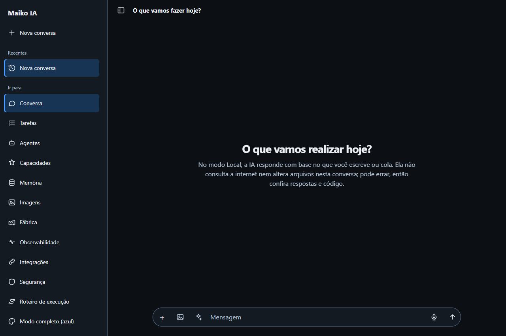
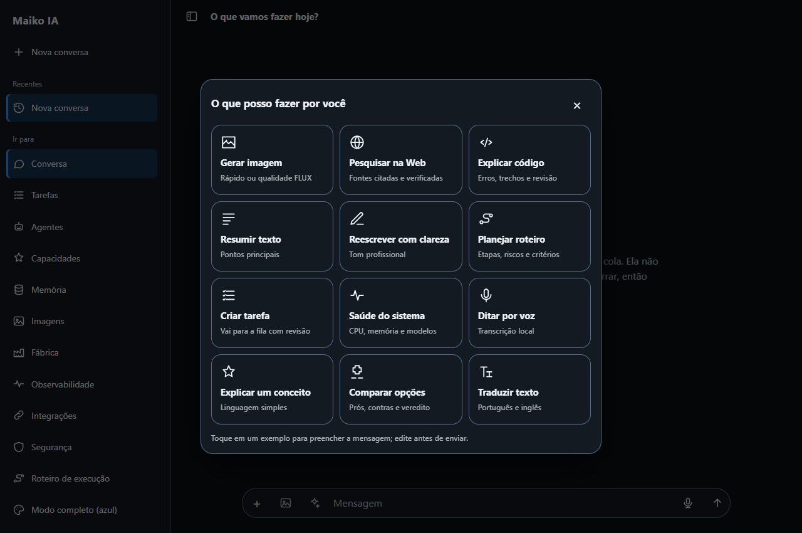
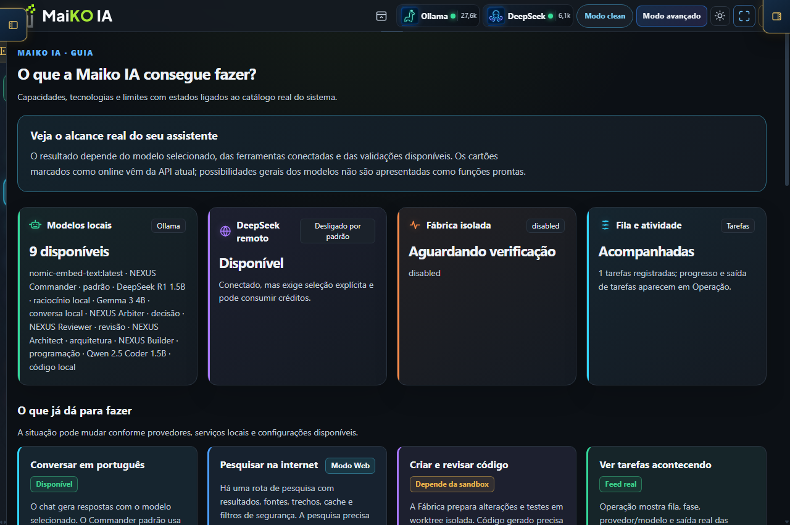
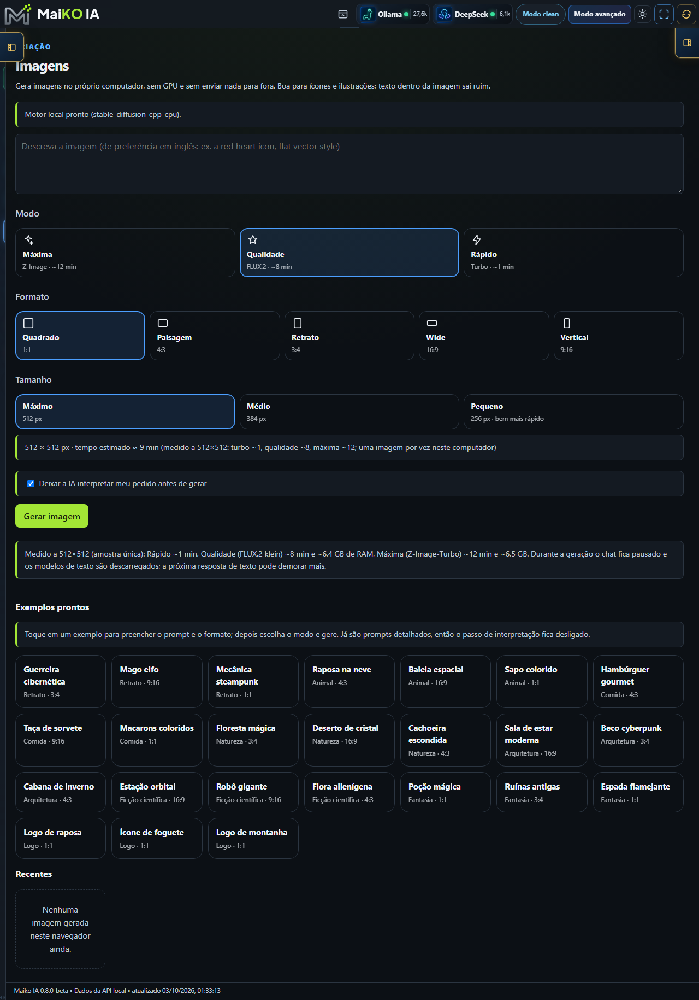
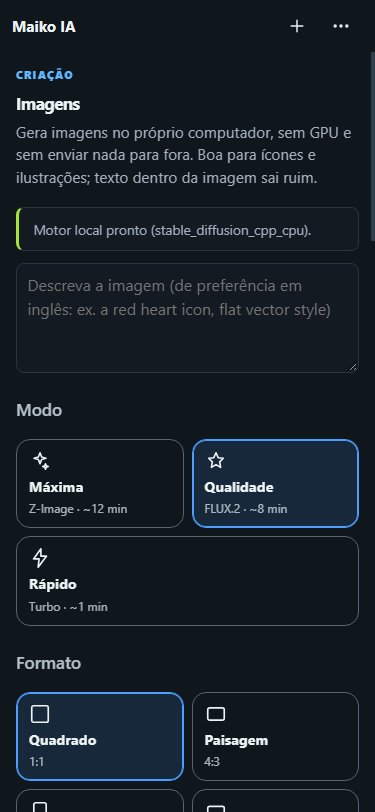
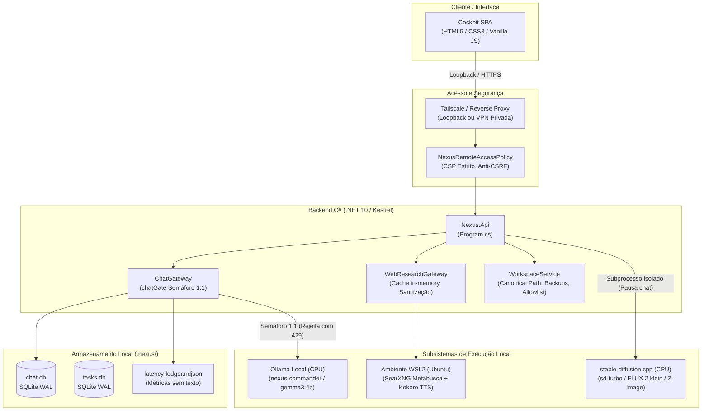

# Maiko IA

> **Repositório vitrine.** Este repositório contém apenas a apresentação do projeto (README e capturas de tela). O código-fonte da Maiko IA é privado. Autor: Caio Alba de Camargo.

A Maiko IA é um assistente pessoal *local-first* construído em C#/.NET 10 e web standards (HTML/JS puro), projetado para operar inteiramente em hardware modesto de consumo utilizando apenas CPU (sem GPU dedicada).
O sistema integra conversação com modelos locais via Ollama, metabusca Web com verificação sintática de citações, geração e interpretação local de imagens, síntese de voz pt-BR e manipulação segura de arquivos locais.
O projeto prioriza a engenharia de software aplicada à IA: observabilidade ponta a ponta, orçamentos rígidos de contexto, concorrência controlada e registro empírico de latência, sem expor dados privados para a nuvem.

### Para quem é
- **Engenharia e Pesquisa de IA**: profissionais que buscam estudar a viabilidade prática, gargalos e trade-offs de Small Language Models (SLMs) e modelos de difusão executados puramente em CPU.
- **Avaliadores e Recrutadores Técnicos**: uma demonstração transparente de engenharia de sistemas de IA — abordando concorrência, contenção de recursos, sanitização determinística contra alucinações e isolamento de segurança.
- **Privacidade e Soberania de Dados**: usuários que necessitam de um assistente inteligente e funcional em rede fechada ou privada (via loopback ou VPN Tailscale), com custo zero de tokens e sem dependência de serviços externos.

---

## 1. Capturas da Interface

A interface (Cockpit) é uma Single Page Application responsiva desenvolvida em HTML/CSS/JS nativo, adaptada para telas de desktop e dispositivos móveis (Modo Clean):

| Conversa Desktop | Conversa Celular (Clean) |
| :---: | :---: |
|  |  |
| *Visualização ampla com barra lateral recolhível e histórico local.* | *Compositor compacto de 52 px otimizado para toque e digitação móvel.* |

| Ideias de Prompts | Painel de Capacidades |
| :---: | :---: |
|  |  |
| *Catálogo de ações rápidas, sínteses estruturadas e atalhos.* | *Inspeção em tempo real de modelos, adaptadores e integridade do runtime.* |

| Estúdio de Imagens (Desktop) | Estúdio de Imagens (Celular) |
| :---: | :---: |
|  |  |
| *Seleção de modos (Rápido, Qualidade, Máxima), proporções e presets.* | *Controles compactos de geração local adaptados a telas menores.* |

---

## 2. O que já funciona e Resultados Medidos

Todas as métricas técnicas do projeto são extraídas de execuções reais e armazenadas no ledger versionado um ledger de medições mantido no repositório privado. As medições de referência foram obtidas em um ambiente com processador Intel de 6 núcleos físicos, 16 GB de RAM e sem GPU dedicada, operando com Windows 11 e subsistema WSL2.

| Capacidade | Implementação Técnica | Métricas Observadas e Validação |
| :--- | :--- | :--- |
| **Chat Local** | Orquestração em C# via Ollama (`nexus-commander` / `gemma3:4b`), mantido residente (`keep_alive = -1`). | • **1,07 s** de TTFT e **1,72 s** total em prompt residente curto (amostra única). • Tempo médio de resposta reduzido de **14,5 s para 7,7 s** após enxugamento de prompt de sistema (avaliação A/B, 24 inferências). • Avaliação de prompt de **~33 s para ~22 s** ao alinhar threads aos núcleos físicos (`num_thread=6`). |
| **Busca Web com SearXNG** | Instância local SearXNG no WSL2 (loopback) com fallback para DuckDuckGo; raspagem assíncrona via `trafilatura`. | • **4,7 s** de pesquisa com 5 fontes retornadas via SearXNG (amostra única). • Síntese Web completa (pesquisa nova + modelo local): primeiro texto caiu de **61,0 s para 18,6 s** e total de **116,2 s para 35,7 s** (amostra única, trechos de 300 caracteres, contexto 4096 unificado). • Citações: **4 válidas e 0 inválidas** registradas no ledger na rota normal; fixtures offline com 1,00 de precisão nos 5 primeiros. |
| **Geração de Imagens (3 Modos)** | Motor `stable-diffusion.cpp` compilado para CPU, invocado como subprocesso isolado com descarregamento prévio de LLMs. | • **Modo Rápido (`sd-turbo`)**: **~65 s a 67,6 s** por imagem 512×512 (59,9 s geração, pico de 5,21 GB RAM; amostra única). • **Modo Qualidade (`FLUX.2-klein-4B Q8`)**: **489 s (~8,1 min)**, pico de 6,39 GB RAM (4 passos; amostra única no CLI). • **Modo Máxima (`Z-Image-Turbo Q4_K`)**: **736 s (~12,2 min)**, pico de 6,46 GB RAM (8 passos; amostra única no CLI). • Formato 256×144 verificado fim a fim em **162 s**; etapa de refinamento de prompt por IA em **~20 s**. |
| **Voz Local pt-BR** | Servidor residente em Python/WSL2 executando Kokoro-82M neural; voz padrão Alex (`pm_alex`). | • Geração de **14,4 s de áudio em ~8 s** via API real (amostra única; contra 31 s a frio). • Operação 100% offline, sem envio de voz para nuvem. |
| **Leitura de Imagem (Visão)** | Endpoint `/api/vision/describe` integrado ao `gemma3:4b` multimodal no Ollama. | • Processamento e descrição visual entre **20 s e 60 s** nesta CPU (amostra única). Suporte a anexos no compositor com miniatura imediata. |
| **Pastas com Acesso** | Módulo de workspaces (`/api/workspaces`, `/api/uploads`, edição com diff `ai-edit`). | • Validação rigorosa de caminho canônico, allowlist de diretórios e bloqueio de symlinks/traversal. • Escrita atômica com retenção de até 10 backups e lixeira local; coberto por testes unitários de segurança. |
| **Painel de Execução** | Telemetria contínua via `LocalTelemetryLedger` (`executions.ndjson`) e visualização por etapas no Cockpit. | • Exibição transparente das etapas no navegador (pesquisa, espera do 1º delta, escrita, tempos parciais). • Gravação transacional em SQLite WAL (`chat.db`, `tasks.db`) com overhead < 5 ms, sem persistir conteúdo sensível de mensagens. |

---

## 3. Arquitetura do Sistema

O diagrama abaixo ilustra o fluxo de dados e os mecanismos de contenção de recursos do ecossistema Maiko:

---

## 4. Decisões de Engenharia e Trade-Offs

1. **Inferência Primária Exclusivamente em CPU (Sem GPU)**
   - *Decisão*: Viabilizar a execução integral de SLMs (família Gemma 3 de 4B e Qwen 1.5B) e difusão em processadores comuns de computadores corporativos ou pessoais. Provedores de nuvem (DeepSeek) são opcionais e desligados por padrão.
   - *Trade-off*: Soberania absoluta e custo zero de execução, ao custo de vazão modesta (7 a 15 tokens/s em geração) e latência perceptível no primeiro token (TTFT).

2. **Uma Inferência por Vez (`chatGate = SemaphoreSlim(1, 1)`)**
   - *Decisão*: O backend adota bloqueio rígido de concorrência local. Qualquer requisição concorrente a `/api/chat/stream` é imediatamente rejeitada com código HTTP 429. Durante a geração de imagens, o chat de texto é pausado e os modelos do Ollama são descarregados da memória RAM.
   - *Trade-off*: Garante a estabilidade da máquina host, prevenindo contenção de threads de CPU e esgotamento de memória (evitando *thrashing* de disco), ao custo de limitar o sistema a um perfil estritamente mono-usuário.

3. **Verificação Determinística de Citações e Orçamento Rígido**
   - *Decisão*: Em tarefas de busca Web, trechos de fontes externas são estritamente truncados em 300 caracteres no prompt para aliviar o gargalo de avaliação na CPU. A resposta gerada é filtrada pelo `sanitizeOrphanCitations()`, que expurga referências `[Fonte N]` inexistentes na lista coletada.
   - *Trade-off*: Elimina citações sintaticamente quebradas e links para fontes ausentes, reduzindo expressivamente o tempo de processamento do prompt; no entanto, a verificação semântica do conteúdo afirmado permanece dependente do modelo.

4. **Segurança de Caminhos (*Path Traversal* e Allowlist)**
   - *Decisão*: Todas as rotas de manipulação de pastas e arquivos no `WorkspaceService` forçam a resolução de caminhos canônicos (`Path.GetFullPath`), confrontando-os com uma lista de permissões explícita e rejeitando *symlinks* que apontem para fora da raiz. Sobrescritas geram até 10 backups rotativos de segurança.
   - *Trade-off*: Imunidade a ataques de travessia de diretório (*directory traversal* ou LFI) em rotas consumidas por agentes de IA, exigindo em contrapartida que o operador declare previamente as pastas acessíveis.

---

## 6. Limitações Conhecidas

- **Velocidade de Processamento em CPU**: A inferência de modelos de 4B parâmetros em CPU é lenta. O primeiro trecho de uma síntese Web com busca real pode levar de 18 a 35 segundos, e a resposta completa em torno de 35 a 55 segundos.
- **Risco de Alucinação Factual**: Modelos quantizados pequenos podem inventar dados numéricos ou distorcer fatos mesmo citando `[Fonte N]`. A validação implementada assegura integridade sintática das fontes, mas não atesta veracidade factual absoluta.
- **Geração de Imagens Demorada**: Em hardware baseado puramente em CPU, modelos de alta qualidade como FLUX.2 klein e Z-Image-Turbo levam entre 8 e 12 minutos por imagem de 512×512 px. Além disso, renderização de tipografia ou texto legível dentro de imagens apresenta artefatos.
- **Ambiente de Medição Específico**: Os números apresentados refletem o comportamento de uma máquina específica (Intel i5-8500T, 16 GB RAM); máquinas com especificações distintas apresentarão latências diferentes.
- **Licenças de Modelos**:
  - `sd-turbo`: Artefato sob licença de pesquisa da Stability AI (uso comercial requer licença específica da detentora).
  - `FLUX.2-klein` e `Z-Image-Turbo`: Pesos sob licença Apache-2.0; componentes associados (como encoders ou VAEs específicos) devem ser auditados individualmente antes de uso comercial.
  - `Gemma 3`: Sujeito aos termos de uso do Google Gemma.

---

## 7. Desenvolvimento Assistido por Múltiplas IAs

O desenvolvimento do projeto foi orquestrado paralelamente entre múltiplos modelos de IA, utilizando o Claude Code como coordenador e integrador principal de código.
Seguindo regras próprias de coordenação, cada tarefa recebeu escopo estrito com a política de "um único escritor por arquivo", combinando Codex, DeepSeek, Antigravity e Gemini em análises e revisões cruzadas *read-only*.
Esse fluxo permitiu manter rastreabilidade rigorosa de alterações, testes automatizados constantes e validação empírica contínua das decisões de engenharia.

---

## 8. Roadmap

- [ ] **Pós-Verificação Semântica de Citações**: Motor de checagem determinística pós-geração para validar se o texto gerado possui correspondência direta com o trecho citado.
- [ ] **Reranking e Chunking Híbrido**: Aprimoramento da recuperação na metabusca e no módulo de RAG sobre arquivos locais.
- [ ] **Painel de Execução Detalhado**: Interface interativa dedicada à visualização em tempo real de logs de subprocessos, uso de CPU/RAM e latência por etapa.
- [ ] **Otimização de Ciclo de Memória**: Mecanismo de pré-aquecimento e liberação granular de memória entre o runtime do Ollama e o motor de difusão C++.

---

---

Autor: [Caio Alba de Camargo](https://github.com/caioalba)
